# CSV データのデータベース化

https://rssystem.go.jp/download-csv から入手したデータを加工しデータベース化する
元データには表記ゆれやカラム重複があるため、スクリプトで正規化を行う

### テーブル・ビュー一覧

| 種別     | 名前                                 | 説明                                                      |
| -------- | ------------------------------------ | --------------------------------------------------------- |
| テーブル | `projects_master`                    | 事業の基本情報マスタ（project_name を含む唯一のテーブル） |
| テーブル | `policies`                           | 政策・施策の詳細                                          |
| テーブル | `laws`                               | 法令の詳細                                                |
| テーブル | `subsidies`                          | 補助率の詳細                                              |
| テーブル | `related_projects`                   | 関連事業の詳細                                            |
| テーブル | `budgets`                            | 予算・執行のサマリ                                        |
| テーブル | `budget_items`                       | 歳出予算項目の詳細                                        |
| テーブル | `expenditures`                       | 支出先情報                                                |
| テーブル | `expenditure_flows`                  | 支出先ブロックの資金の流れ                                |
| テーブル | `expenditure_usages`                 | 費目・使途の詳細                                          |
| テーブル | `expenditure_contracts`              | 国庫債務負担行為等の契約情報                              |
| ビュー   | `policies_with_project`              | 政策情報 + 事業名                                         |
| ビュー   | `laws_with_project`                  | 法令情報 + 事業名                                         |
| ビュー   | `subsidies_with_project`             | 補助率情報 + 事業名                                       |
| ビュー   | `related_projects_with_project`      | 関連事業情報 + 事業名                                     |
| ビュー   | `budgets_with_project`               | 予算サマリ + 事業名                                       |
| ビュー   | `budget_items_with_project`          | 予算項目 + 事業名                                         |
| ビュー   | `expenditures_with_project`          | 支出先情報 + 事業名                                       |
| ビュー   | `expenditure_flows_with_project`     | 支出ブロックの流れ + 事業名                               |
| ビュー   | `expenditure_usages_with_project`    | 費目・使途 + 事業名                                       |
| ビュー   | `expenditure_contracts_with_project` | 契約情報 + 事業名                                         |
| ビュー   | `projects_summary`                   | 事業ごとの関連情報サマリ                                  |

### クエリ例

```sql
-- VIEW を使った簡単なクエリ
SELECT * FROM expenditures_with_project
WHERE ministry = '内閣府'
ORDER BY amount DESC LIMIT 10;

-- 事業サマリを取得
SELECT * FROM projects_summary
WHERE policy_count > 0 OR expenditure_count > 0
ORDER BY expenditure_count DESC;

-- テーブルを直接 JOIN する場合
SELECT
    pm.project_name,
    e.recipient_name,
    e.amount
FROM expenditures e
JOIN projects_master pm USING (project_year, project_id)
WHERE e.amount IS NOT NULL
ORDER BY CAST(e.amount AS INTEGER) DESC
LIMIT 10;
```


## 共通の正規化方針

### サニタイズ（全カラム）

すべてのカラムに対して無効文字の除去を実施

| 処理内容       | 詳細                                                            |
| -------------- | --------------------------------------------------------------- |
| NULL 文字除去  | `\x00` を削除                                                   |
| 制御文字除去   | `\x00-\x1F`, `\x7F` を空白に置換                                |
| 改行コード統一 | `\r\n`, `\r` → `\n`                                             |
| 前後空白除去   | `strip()`                                                       |
| 欠損値統一     | `"－"`, `"─"`, `"—"`, `"該当なし"`, `"なし"`, `"無し"` → `NULL` |

### 正規化（一部のみ）

自由記述テキストのみ正規化ライブラリ [neologdn](https://github.com/ikegami-yukino/neologdn) を使用

正規化内容:
- 全角半角の統一
- Unicode NFKC 正規化
- 長音符・波ダッシュの統一
- 連続する空白の削除

正規化対象カラムは各セクションのドキュメントで定義する

### データ保持方針

- 年度・フラグ・金額などは型変換を行わず TEXT 型で保持
- データの欠損・変換失敗による情報喪失を防ぐ
- 必要に応じてクエリ時に `CAST()` で変換


## セクションごとの詳細

各セクションのテーブル設計と正規化対象カラムの詳細は以下を参照:

- **基本情報セクション**: [build_database/basic_info.md](./build_database/basic_info.md)
  - 対象: `input/1-*.csv`（5ファイル）
  - 出力: 5テーブル（`projects_master`, `policies`, `laws`, `subsidies`, `related_projects`）
  - **注**: `projects_master` がマスタテーブルとなり、他のテーブルはこれを参照

- **予算・執行セクション**: [build_database/budget_execution.md](./build_database/budget_execution.md)
  - 対象: `input/2-*.csv`（2ファイル）
  - 出力: 2テーブル（`budgets`, `budget_items`）
  - **注**: `project_name` は削除済み、`projects_master` との JOIN で取得

- **支出先セクション**: [build_database/expenditure.md](./build_database/expenditure.md)
  - 対象: `input/5-*.csv`（4ファイル）
  - 出力: 4テーブル（`expenditures`, `expenditure_flows`, `expenditure_usages`, `expenditure_contracts`）
  - **注**: `project_name` は削除済み、`projects_master` との JOIN で取得


## 設計

### 構成

```
tools/
├─ build_database.py         # メインスクリプト（セクション統合）
├─ build_database/
│   ├─ __init__.py          # パッケージ初期化（空ファイル）
│   ├─ common.py            # 共通関数（sanitize, normalize, load_csv）
│   ├─ basic_info.py        # 基本情報セクション（1-*.csv → 5テーブル）
│   ├─ budget_execution.py  # 予算・執行セクション（2-*.csv → 2テーブル）
│   ├─ expenditure.py       # 支出先セクション（5-*.csv → 4テーブル）
│   └─ create_views.sql     # VIEW 定義（JOIN を隠蔽）
├─ requirements.txt          # pandas, neologdn
└─ .venv/                    # 仮想環境
```

### ドキュメント

```
docs/tools/build_database/
├─ basic_info.md             # 基本情報セクションの正規化方針
├─ budget_execution.md       # 予算・執行セクションの正規化方針
└─ expenditure.md            # 支出先セクションの正規化方針
```

### 実装

#### メインスクリプト（`build_database.py`）

各セクションの処理を統合してデータベースを生成する

**主要な処理フロー:**
1. 基本情報セクションのテーブル構築
2. 予算・執行セクションのテーブル構築
3. 支出先セクションのテーブル構築
4. SQLite への書き込み
5. データ検証

**出力:** `output/rs_data.sqlite`

#### 基本情報セクション（`basic_info.py`）

`input/1-*.csv` から5つのテーブルを構築する

**構築するテーブル（正規化済み）:**
- `projects_master`: 事業基本情報マスタ（1-1 と 1-2 を結合）- **project_name を含む唯一のテーブル**
- `policies`: 政策・施策との紐付け（1-3 から抽出）- project_name なし
- `laws`: 法令との紐付け（1-3 から抽出）- project_name なし
- `subsidies`: 補助率情報（1-4）- project_name なし
- `related_projects`: 関連事業（1-5）- project_name なし

**主要な関数:**
- `build_basic_info_tables()`: エントリーポイント
- `build_projects_master_table()`: projects_master テーブルの構築
- `build_policies_table()`: policies テーブルの構築
- `build_laws_table()`: laws テーブルの構築
- `build_subsidies_table()`: subsidies テーブルの構築
- `build_related_projects_table()`: related_projects テーブルの構築

#### 予算・執行セクション（`budget_execution.py`）

`input/2-*.csv` から2つのテーブルを構築する

**構築するテーブル（正規化済み）:**
- `budgets`: 予算・執行サマリ（2-1）- project_name なし
- `budget_items`: 歳出予算項目の詳細（2-2）- project_name なし

**主要な関数:**
- `build_budget_execution_tables()`: エントリーポイント
- `build_budget_summary_table()`: budgets テーブルの構築
- `build_budget_detail_table()`: budget_items テーブルの構築

#### 支出先セクション（`expenditure.py`）

`input/5-*.csv` から4つのテーブルを構築する

**構築するテーブル（正規化済み）:**
- `expenditures`: 支出先情報（5-1）- project_name なし
- `expenditure_flows`: 支出先ブロックのつながり（5-2）- project_name なし
- `expenditure_usages`: 費目・使途（5-3）- project_name なし
- `expenditure_contracts`: 国庫債務負担行為等による契約（5-4）- project_name なし

**主要な関数:**
- `build_expenditure_tables()`: エントリーポイント
- `build_expenditure_info_table()`: expenditures テーブルの構築
- `build_expenditure_flow_table()`: expenditure_flows テーブルの構築
- `build_expenditure_usage_table()`: expenditure_usages テーブルの構築
- `build_expenditure_contract_table()`: expenditure_contracts テーブルの構築

#### 共通関数（`common.py`）

全セクションで使用する共通的な処理を提供する

**主要な関数:**
- `sanitize()`: 制御文字除去・欠損値統一
- `normalize()`: neologdn による正規化
- `load_csv()`: CSV 読み込み（UTF-8-SIG、dtype=str）
- `apply_sanitize_and_normalize()`: DataFrame へのサニタイズと正規化の適用
- `validate_table()`: テーブル検証（行数、主キー重複、NULL率）


## 実行方法

```bash
cd /home/grassfield/git/_team-mirai/govis

# 仮想環境の作成（初回のみ）
python3 -m venv tools/.venv
source tools/.venv/bin/activate
pip install -r tools/requirements.txt

# データベース生成
tools/.venv/bin/python3 tools/build_database.py

# ビューの適用
sqlite3 output/rs_data.sqlite < tools/build_database/create_views.sql
```

**出力:**
- `output/rs_data.sqlite` - 正規化済みデータベース（73MB、11テーブル、377,020行）
- 11個の便利な VIEW が追加されます

## ER図

```mermaid
erDiagram
    %% 事業マスタ
    PROJECTS_MASTER {
        int project_year PK
        text project_id PK
        text project_name
        text ministry
        text bureau
        text department
        text division
    }

    %% 基本情報の詳細テーブル
    POLICIES {
        int project_year PK,FK
        text project_id PK,FK
        int seq_no PK
        text policy_name
        text measure_name
    }

    LAWS {
        int project_year PK,FK
        text project_id PK,FK
        int seq_no PK
        text law_name
        text law_number
    }

    SUBSIDIES {
        int project_year PK,FK
        text project_id PK,FK
        int seq_no PK
        text subsidy_target
        text subsidy_rate
    }

    RELATED_PROJECTS {
        int project_year PK,FK
        text project_id PK,FK
        int seq_no PK
        text related_project_id
        text related_project_name
    }

    %% 予算・執行の詳細テーブル
    BUDGETS {
        int project_year PK,FK
        text project_id PK,FK
        int budget_year PK
        int seq_no PK
        text account_category
        text initial_budget
        text execution_amount
    }

    BUDGET_ITEMS {
        int project_year PK,FK
        text project_id PK,FK
        int budget_year PK
        int seq_no PK
        text budget_type
        text budget_amount
    }

    %% 支出先の詳細テーブル
    EXPENDITURES {
        int project_year PK,FK
        text project_id PK,FK
        int seq_no PK
        text recipient_name
        text amount
    }

    EXPENDITURE_FLOWS {
        int project_year PK,FK
        text project_id PK,FK
        int seq_no PK
        text source_block
        text destination_block
    }

    EXPENDITURE_USAGES {
        int project_year PK,FK
        text project_id PK,FK
        int seq_no PK
        text expense_item
        text usage
    }

    EXPENDITURE_CONTRACTS {
        int project_year PK,FK
        text project_id PK,FK
        int seq_no PK
        text contractor_name
        text contract_amount
    }

    %% リレーション
    PROJECTS_MASTER ||--o{ POLICIES : "has"
    PROJECTS_MASTER ||--o{ LAWS : "has"
    PROJECTS_MASTER ||--o{ SUBSIDIES : "has"
    PROJECTS_MASTER ||--o{ RELATED_PROJECTS : "has"
    PROJECTS_MASTER ||--o{ BUDGETS : "has"
    PROJECTS_MASTER ||--o{ BUDGET_ITEMS : "has"
    PROJECTS_MASTER ||--o{ EXPENDITURES : "has"
    PROJECTS_MASTER ||--o{ EXPENDITURE_FLOWS : "has"
    PROJECTS_MASTER ||--o{ EXPENDITURE_USAGES : "has"
    PROJECTS_MASTER ||--o{ EXPENDITURE_CONTRACTS : "has"
```


